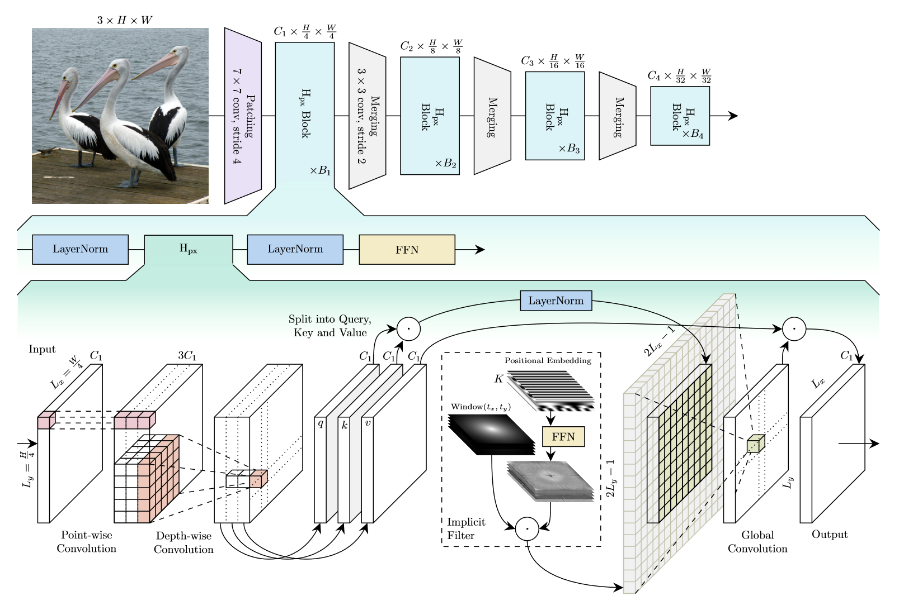

# [HyenaPixel: Global Image Context with Convolutions](https://arxiv.org/abs/2402.19305)

<p align="left">
<a href="https://arxiv.org/abs/2402.19305" alt="arXiv">

</a>
</p>

Official PyTorch implementation for our paper "[HyenaPixel: Global Image Context with Convolutions](https://arxiv.org/abs/2402.19305)".



## Setup

Create a conda environment and install the requirements.
```bash
conda create -n hyenapixel python=3.10
conda activate hyenapixel
pip install torch torchvision --index-url https://download.pytorch.org/whl/cu118
pip install -e .
```

### Dataset

Prepare ImageNet-1k with [this script](https://gist.github.com/BIGBALLON/8a71d225eff18d88e469e6ea9b39cef4).

## Models

| Model              | Resolution | Params | Top1 Acc |                                   Download                                   |
| :----------------- | :--------: | :----: | :------: | :--------------------------------------------------------------------------: |
| hpx_former_s18     |    224     |  29M   |   83.2   |   [HuggingFace](https://huggingface.co/Spravil/hpx_former_s18.westai_in1k)   |
| hpx_former_s18_384 |    384     |  29M   |   84.7   | [HuggingFace](https://huggingface.co/Spravil/hpx_former_s18.westai_in1k_384) |
| hb_former_s18      |    224     |  28M   |   83.5   |   [HuggingFace](https://huggingface.co/Spravil/hb_former_s18.westai_in1k)    |
| c_hpx_former_s18   |    224     |  28M   |   83.0   |  [HuggingFace](https://huggingface.co/Spravil/c_hpx_former_s18.westai_in1k)  |
| hpx_a_former_s18   |    224     |  28M   |   83.6   |  [HuggingFace](https://huggingface.co/Spravil/hpx_a_former_s18.westai_in1k)  |
| hb_a_former_s18    |    224     |  27M   |   83.2   |  [HuggingFace](https://huggingface.co/Spravil/hb_a_former_s18.westai_in1k)   |
| hpx_former_b36     |    224     |  111M  |   84.9   |   [HuggingFace](https://huggingface.co/Spravil/hpx_former_b36.westai_in1k)   |
| hb_former_b36      |    224     |  102M  |   85.2   |   [HuggingFace](https://huggingface.co/Spravil/hb_former_b36.westai_in1k)    |

## Usage

### Training

We trained our models with 8 Nvidia A100 GPUs with the SLURM scripts located in `./scripts/`.
Adjust the SLURM parameters `NUM_GPU` and `GRAD_ACCUM_STEPS` to match your system.

For object detection and segmentation view the [detection](detection/) and [segmentation](segmentation/) folders. 

### Validation

Run the following command to validate the `hpx_former_s18`.
Replace `data/imagenet` with the path to ImageNet-1k and `hpx_former_s18` wtih the model you intend to validate.

```bash
python validate.py data/imagenet --model hpx_former_s18
```

## Acknowledgments

Our implementation is based on [HazyResearch/safari](https://github.com/HazyResearch/safari/), [rwightman/pytorch-image-models](https://github.com/rwightman/pytorch-image-models) and [sail-sg/metaformer](https://github.com/sail-sg/metaformer).
This research has been funded by the Federal Ministry of Education and Research of Germany under grant no. 01IS22094C WEST-AI.

## Bibtex

```
@article{spravil2024hyenapixel,
  title={HyenaPixel: Global Image Context with Convolutions},
  author={Julian Spravil and Sebastian Houben and Sven Behnke},
  journal={arXiv preprint arXiv:2402.19305},
  year={2024},
}
```
